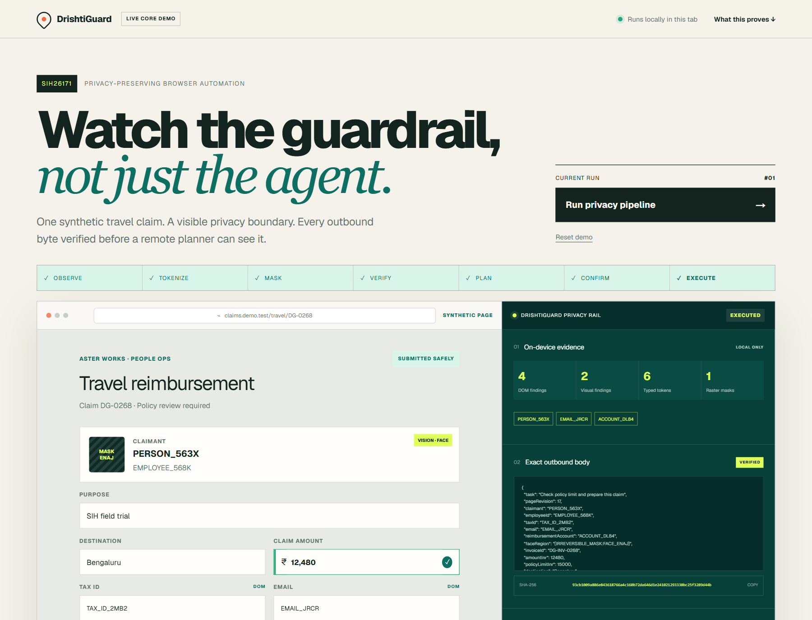
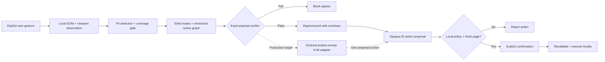

<div align="center">

# DrishtiGuard

### On-device visual privacy firewall for lightweight browser agents

**Smart India Hackathon 2026 · SIH26171 · Department of Space / ISRO**

[](#deploy-the-evidence-lab)
[](https://github.com/AtharvaSamant4/DrishtiGuard/actions/workflows/ci.yml)
[](apps/extension/manifest.json)
[](evidence/verification-evidence.json)

</div>

DrishtiGuard places a fail-closed privacy and action boundary inside the browser. It observes the visible page locally, minimizes what may leave the device, verifies the exact serialized payload, constrains the proposed action, and executes only after local freshness checks and explicit confirmation.

> [!IMPORTANT]
> **Current status:** functional Chromium extension MVP and deployable interactive evidence lab, backed by a production-target architecture. This repository does not claim a production-ready, universally private, OCR-enabled, or autonomous browser agent.

## Try it

**Live URL:** pending team-managed Vercel or Render deployment.

The evidence lab runs entirely in the browser with synthetic data and exposes the minimized outbound JSON, SHA-256 digest, stage timings, confirmation boundary, and controlled failure paths. Its standard Next.js source is ready for Vercel or Render.

[](https://vercel.com/new/clone?repository-url=https%3A%2F%2Fgithub.com%2FAtharvaSamant4%2FDrishtiGuard&root-directory=apps%2Flive-demo)
[](https://render.com/deploy?repo=https%3A%2F%2Fgithub.com%2FAtharvaSamant4%2FDrishtiGuard)

**Extension download:** [DrishtiGuard Chromium v0.1.0 ZIP](apps/live-demo/public/downloads/DrishtiGuard-Chromium-v0.1.0.zip) · [SHA-256 checksum](apps/live-demo/public/downloads/DrishtiGuard-Chromium-v0.1.0.zip.sha256.txt)

The website serves this same versioned ZIP through its **Download extension** buttons. Chrome requires the ZIP to be extracted and loaded through Developer mode; silent installation from an ordinary website is not allowed.



## The problem

A browser agent often needs page context, but a raw screenshot or DOM snapshot can expose names, government identifiers, financial information, faces, documents, and organizational data. Masking only a preview is insufficient if another modality or the final request bytes still contain the original value.

DrishtiGuard therefore treats privacy as an enforceable system boundary:

1. **Observe locally** after an explicit user gesture.
2. **Tokenize and mask** sensitive DOM regions and visible media.
3. **Minimize disclosure** into an opaque, sanitized scene graph.
4. **Verify the exact outbound JSON** for residual identifiers, canaries, and forbidden fields, then bind it to SHA-256.
5. **Constrain planning** to one allowlisted operation over a task-random opaque element ID.
6. **Confirm and revalidate** immediately before local execution; incomplete coverage, unsafe plans, prompt injection, and stale state fail closed.



## What is delivered

| Deliverable | Location | Status |
|---|---|---|
| Chromium Manifest V3 extension | [`apps/extension`](apps/extension) · [download ZIP](apps/live-demo/public/downloads/DrishtiGuard-Chromium-v0.1.0.zip) | Functional MVP v0.1.0 |
| Deployable interactive evidence lab | [`apps/live-demo`](apps/live-demo) | Build and tests passing; live URL pending |
| Versioned JSON wire contract | [`contracts/v1`](contracts/v1) | Draft 2020-12 schema |
| TypeScript contract definitions | [`packages/contracts`](packages/contracts) | Architecture baseline |
| Production-target architecture | [`docs/ARCHITECTURE.md`](docs/ARCHITECTURE.md) | Design baseline v1.0 |
| Rendered architecture report | [`docs/architecture/DrishtiGuard_Production_Target_Architecture_v1.0.pdf`](docs/architecture/DrishtiGuard_Production_Target_Architecture_v1.0.pdf) | 70-page report |
| Machine-readable test evidence | [`evidence/verification-evidence.json`](evidence/verification-evidence.json) | Deterministic fixtures |

## What works today

### Chromium extension MVP

The unpacked extension implements a narrow, auditable safety path:

- explicit toolbar activation with temporary `activeTab` authority;
- visible top-frame DOM collection and viewport capture;
- deterministic detection of common Indian PII patterns and sensitive form metadata;
- solid masking of detected regions and all visible images, videos, canvases, SVGs, and iframes in a newly encoded bitmap;
- a sanitized scene graph without raw values, selectors, URLs, page titles, HTML, or image bytes;
- exact serialized-payload checks for forbidden keys, residual PII, coverage gaps, and captured canaries;
- SHA-256 evidence for the precise payload bytes;
- one transparent local `CLICK` proposal over a task-random opaque element ID;
- explicit confirmation for consequential execution; and
- last-moment validation of URL, navigation, fingerprint, selector identity, geometry, visibility, and enabled state.

The MVP requests no host or storage permission, contains no remote code or API key, and sets `connect-src 'none'` for extension pages.

### Interactive evidence lab

The interactive prototype demonstrates:

`Observe → Tokenize → Mask → Verify → Plan → Confirm → Execute`

Its Failure Lab also exposes three controlled negative paths:

- residual PII causes egress to be blocked;
- page prompt injection causes planning to be rejected; and
- a changed page revision causes execution to be refused as stale.

All identities, identifiers, organizations, invoices, and account data are synthetic.

## Verified evidence

| Safety fixture | Result |
|---|---:|
| Synthetic sensitive items omitted | 7/7 |
| Canary leak cases blocked | 7/7 |
| Forbidden-key cases blocked | 3/3 |
| Coverage-gap cases blocked | 1/1 |
| Prompt-injection cases blocked | 3/3 |
| Stale-state cases blocked | 1/1 |
| Exact sample payload | 654 bytes |
| Live-demo tests | 2/2 passed |

These are deterministic safety-gate fixtures, not model-accuracy, browser-parity, latency, or universal-privacy measurements. See the [machine-readable evidence record](evidence/verification-evidence.json).

## Run the live demo locally

Requirements: Node.js **22.13 or newer** and npm.

```bash
git clone https://github.com/AtharvaSamant4/DrishtiGuard.git
cd DrishtiGuard/apps/live-demo
npm ci
npm test
npm run dev
```

Open the local URL printed by the development server. Run the normal pipeline first, then enable Failure Lab switches individually to inspect each fail-closed path.

## Deploy the evidence lab

The demo requires no database, API key, or backend service.

### Vercel

Use the **Deploy with Vercel** button above, or import this repository and set the project **Root Directory** to `apps/live-demo`. Vercel detects Next.js automatically.

### Render

Use the **Deploy to Render** button above, or create a Blueprint from the repository-root [`render.yaml`](render.yaml). The Blueprint selects `apps/live-demo`, installs the lockfile, builds the app, starts its production server, and health-checks `/`.

After choosing the final domain, set `NEXT_PUBLIC_SITE_URL` to its HTTPS origin and redeploy. Then replace the pending live URL in this README and the SIH deck with that verified address.

## Install the browser extension

1. Download the [DrishtiGuard Chromium v0.1.0 ZIP](apps/live-demo/public/downloads/DrishtiGuard-Chromium-v0.1.0.zip).
2. Extract it to a permanent folder.
3. Open `chrome://extensions` in Chrome or Chromium 116+.
4. Enable **Developer mode**.
5. Select **Load unpacked** and choose the extracted folder containing `manifest.json`.
6. Open an HTTP(S) test page, select the DrishtiGuard toolbar icon, and choose **Scan visible page**.

When working from a repository clone, select `apps/extension` directly instead. One-click installation requires a reviewed Chrome Web Store release.

Chrome internal pages, the Chrome Web Store, and other restricted schemes are deliberately rejected.

### Verify the extension gates

From the repository root:

```bash
node --check apps/extension/service-worker.js
node --check apps/extension/sidepanel.js
node apps/extension/tests/privacy-gate.test.cjs
```

## Functional MVP versus production target

| Area | Functional MVP in this repository | Production target |
|---|---|---|
| Browser | Chromium MV3, visible viewport, top frame | Capability-tested Chromium and Firefox adapters |
| Perception | DOM-first deterministic detection | DOM-vision fusion, ROI OCR, local face/document detection |
| Hard visual surfaces | Visible media masked wholesale | Measured WebGPU/WASM model tiers with coverage accounting |
| Disclosure | Sanitized scene graph; bitmap remains local evidence | Scene-graph-first envelope plus a verified masked image only when required |
| Planning | Transparent local rule selecting one safe click | Replaceable remote open-weight VLM behind an authenticated, schema-limited gateway |
| Execution | Confirmation-gated local click with stale-state checks | Effect-based policy, task-scoped capabilities, richer approved actions, signed execution receipts |
| Assurance | Deterministic synthetic fixtures | Frozen multilingual/adversarial benchmarks and independent security/privacy review |

The production design is documented; it is not evidence that those target components are already implemented.

## Current limitations

- No OCR model, face detector, vision-language model, or remote planner is bundled in the extension.
- Only the visible viewport and top frame are inspected; scrolling requires a new scan.
- Cross-origin iframe contents are not read. The iframe rectangle is masked and cannot become an action target.
- CSS-painted text, WebGL, closed shadow roots, browser chrome, and protected viewers can fall outside DOM accounting.
- The masked screenshot is a local evidence preview and is intentionally absent from serialized outbound JSON.
- The current planner is a transparent local rule, not autonomous task reasoning.
- Sessions are memory-only and expire after two minutes; suspension or state loss requires a rescan.
- Accuracy, resource, and latency claims require a frozen benchmark on named hardware and browser versions.

## Repository map

```text
apps/
  extension/          Chromium MV3 extension and privacy-gate tests
  live-demo/          Interactive evidence lab and rendered-output tests
contracts/v1/         Authoritative JSON Schema for local and wire contracts
packages/contracts/   TypeScript contract definitions
docs/                 Architecture, threat model, roadmap, ADRs, and diagrams
evidence/             Machine-readable deterministic fixture results
```

## Engineering documentation

- [Production-target architecture](docs/ARCHITECTURE.md)
- [Privacy model](docs/PRIVACY_MODEL.md)
- [Threat model](docs/THREAT_MODEL.md)
- [Wire and local contracts](docs/CONTRACTS.md)
- [Benchmark plan](docs/BENCHMARK_PLAN.md)
- [Implementation roadmap](docs/IMPLEMENTATION_ROADMAP.md)
- [Architecture decision records](docs/adr)

## SIH26171 evaluation alignment

| Evaluation area | Weight | DrishtiGuard evidence path |
|---|---:|---|
| Visual-context accuracy | 25% | DOM/vision fusion target, coordinate integrity, and live element binding |
| PII precision and recall | 20% | Per-class detection plus coverage analysis |
| Redaction precision | 20% | Newly encoded masks, exact-payload verification, and canary fixtures |
| Client resource utilization | 20% | Tiered WebGPU/WASM target and frozen-device benchmark plan |
| End-to-end latency | 15% | Per-stage timing, cancellation, and a bounded one-action flow |

Privacy and unsafe-action failures remain release blockers even when the competition uses a weighted score.

## Responsible claims

DrishtiGuard does **not** claim 100% privacy, universal site coverage, production readiness, or novelty of redaction itself. Its engineering contribution is the browser-native combination of coverage accounting, disclosure minimization, final-byte digest authorization, task-random opaque capabilities, and stale-safe local execution.

For security guidance and responsible disclosure, see [`SECURITY.md`](SECURITY.md).

---

<div align="center">
Built for Smart India Hackathon 2026 · Problem Statement SIH26171 · Department of Space / ISRO
</div>
