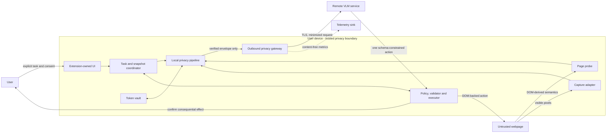
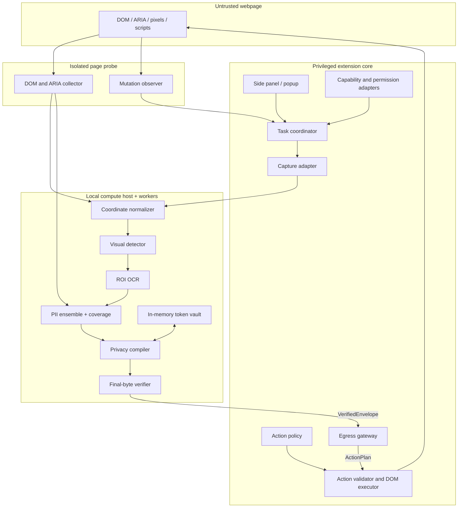
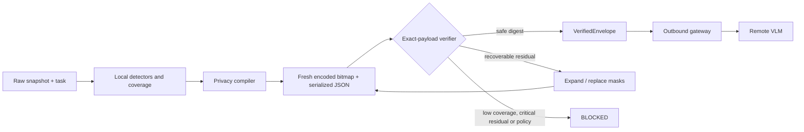
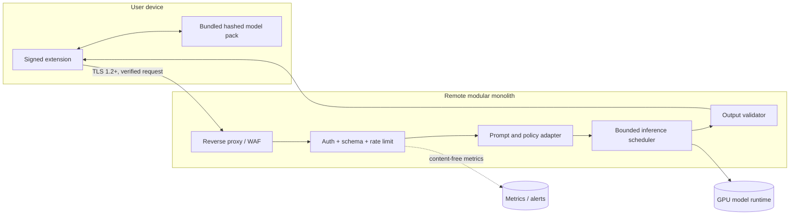

# DrishtiGuard Production Target Architecture

**Problem statement:** SIH26171 - On-device Visual Perception for Light-weight Browser Agents  
**Organization:** Department of Space / Indian Space Research Organisation (ISRO)  
**Category and theme:** Software / Smart Automation  
**Document status:** Architecture baseline v1.0  
**Verified:** 4 September 2026 against the live official SIH problem-statement page [R1]  
**Interpretation:** This is a production-target design and a hackathon implementation plan. It is not evidence that a production-ready system exists.

## 1. Executive decision

Build **DrishtiGuard** as a browser-native, fail-closed pixel firewall for AI browser agents. The browser extension performs capture, semantic extraction, local perception, privacy compilation, final-byte leakage verification, action validation, user confirmation and execution. A remote vision-language model receives only a verified, minimized representation and returns exactly one schema-constrained action over an opaque element ID.

The central design decision is not merely to detect PII and cover pixels. DrishtiGuard makes privacy and execution safety architectural capabilities:

- The privacy path combines DOM-derived semantics and visual evidence. Privacy masking uses the union of findings; action grounding requires stronger concordance and a live DOM binding.
- A coverage analyzer distinguishes "nothing detected" from "the entire visible surface was examined." Unknown or unprocessed regions are masked or block egress.
- The privacy compiler sanitizes every outbound modality: image, scene graph, accessible names, attributes, URLs, user task and action arguments.
- A separate verifier examines the exact encoded image and serialized request. It authorizes only that payload digest.
- Only the outbound privacy gateway can send page-derived content. Its input type cannot represent a raw screenshot, raw DOM, token map, selector or user secret.
- Typed placeholders are backed by unguessable, task-scoped token capabilities held in memory locally. Literal text such as `[PAN_1]` is display-only and never resolves by itself.
- The remote model cannot execute code. It returns one validated action; the local policy engine determines risk from effect and context, not merely the action verb.
- Every action is bound to a current snapshot, navigation epoch, mutation epoch and target fingerprint. High-risk actions require extension-owned confirmation and a second revalidation after confirmation.

The strongest honest guarantee is:

> Original capture buffers and reversible token mappings are structurally prohibited from egress. Content discovered or classified as sensitive is blocked or transformed, with residual detection risk measured on a declared benchmark.

No architecture that uses probabilistic PII recognition can truthfully guarantee that every unknown sensitive fact will always be detected. Universal "100% privacy" is therefore not a permitted product claim.

## 2. Problem verification and architecture drivers

The official SIH page identifies SIH26171, the stated title, ISRO, Software, Smart Automation, Chrome and Firefox, local vision processing, a privacy-preserving filter, a centralized LLM/VLM and an end-to-end assisted task [R1]. It assigns the following evaluation weights:

| Evaluation metric | Weight | Architectural driver |
|---|---:|---|
| Visual-context accuracy | 25% | DOM/vision fusion, coordinate integrity, live element binding |
| PII precision and recall | 20% | Ensemble recognition, per-class calibration, coverage analysis |
| Redaction precision | 20% | Privacy compiler, fresh bitmap generation, exact-payload verifier |
| Client resource utilization | 20% | Quantized tiered runtime, ROI OCR, buffer reuse, backpressure |
| End-to-end latency | 15% | Event-driven capture, cache, cancellation, one-step plans |

Privacy is a release gate even though the competition uses a weighted score. A faster pipeline is not allowed to omit a detector or verifier.

### 2.1 Prior art and defensible differentiation

GUIGuard already defines recognition, protection and protected execution for GUI agents, and reports that privacy recognition remains a bottleneck [R10]. Newer work also studies type-preserving placeholders [R11] and context-aware exposure control [R12]. DrishtiGuard must not claim that redaction or typed anonymization is unprecedented.

Its defensible engineering advance is the combination of:

1. browser-native dual-signal collection with explicit coverage accounting;
2. scene-graph-first disclosure minimization;
3. final-byte verification bound cryptographically to the outgoing request;
4. task-random typed token capabilities rather than model-resolvable strings;
5. a sole, schema-limited egress path;
6. opaque target binding, stale-plan rejection and post-confirmation revalidation;
7. capability-driven Chrome/Firefox adapters; and
8. benchmark evidence that jointly reports privacy, utility and resource cost.

These are system differentiators, not a research-novelty claim until measured against current baselines.

## 3. Scope

### 3.1 In scope

- A WebExtensions MV3 browser extension built from one TypeScript codebase, with Chromium and Firefox adapters.
- Explicit user activation using temporary `activeTab` authority where supported [R3, R5].
- Visible-viewport capture and DOM-derived accessibility semantics for the top-level document, accessible same-origin frames and open shadow roots.
- Local visual detection, region-of-interest OCR, PII classification, typed tokenization, masking and final leakage verification.
- A minimized remote request containing a sanitized task, sanitized element graph and, only when necessary, a newly encoded sanitized image.
- A stateless remote planning endpoint using an open/open-weight VLM, with Qwen3-VL-4B-Instruct as a benchmark candidate rather than a preselected winner [R13].
- One action per model response, local validation, deterministic policy, user confirmation for consequential effects and post-action verification.
- Privacy-safe metrics, fault injection, contract tests and a synthetic employee travel-claim demonstration.

### 3.2 Non-goals for the hackathon MVP

- Universal automation across the open web.
- Native-trusted clicks inside arbitrary canvas, browser chrome, protected PDF viewers, closed shadow DOM or inaccessible cross-origin frames.
- Login, passwords, OTP entry, payment, file upload, deletion or permission changes.
- Full native browser accessibility-tree access. A minimally privileged WebExtension observes DOM/ARIA-derived semantics, not the complete platform accessibility tree.
- Guaranteed detection of every possible confidential fact, steganographic signal or inferential disclosure.
- Full offline planning. Privacy processing remains local when offline, but remote planning is unavailable.
- Safari support, enterprise fleet management, production data residency certification or a general-purpose agent marketplace.

### 3.3 Prototype vertical slice

The end-to-end slice is a synthetic employee travel-claim portal containing a synthetic name, face, employee ID, PAN-shaped value, Aadhaar-shaped value, account/IFSC pair, email, invoice image, claim amount and submit control. The user task is: "Check whether the claim is within the declared policy limit and submit after confirmation."

The local system computes the privacy-safe derived fact `within_policy_limit=true`; it does not need to disclose the exact amount if financial amounts are classified as sensitive. The hard surface is an invoice rendered into canvas or an image with missing ARIA metadata. All values are deterministically generated synthetic values that are invalid against real registries.

## 4. Recommended assumptions

These defaults unblock design. They must be confirmed before implementation commitments.

| Decision area | Recommended working assumption |
|---|---|
| Team and time | Six members with pre-event preparation and a 36-48 hour finale sprint |
| Primary client | Modern Chromium on Windows x64; test the latest two stable versions at benchmark freeze |
| Compatibility client | Current Firefox stable using WASM; functional support first, measured parity later |
| Client hardware | 4+ CPU cores, 16 GB RAM, WebGPU optional; integrated GPU is the baseline case |
| Page scope | Visible viewport on explicitly supported HTTP(S) origins |
| Action scope | Top-level and accessible same-origin DOM-backed targets only |
| Concurrency | One active task per tab; one active inference job per task |
| Remote service | Self-hosted modular monolith on an India-region or approved on-prem GPU host |
| Authentication | Short-lived demo token for MVP; OIDC Authorization Code + PKCE for pilot, no embedded client secret |
| PII classes | Credentials, OTPs, tokens, Aadhaar, PAN, account/IFSC, cards, employee IDs, names, faces, emails, phones, addresses, medical and financial data |
| Data retention | Raw frames and token maps in memory only; sanitized request bodies have zero server retention by default |
| Telemetry | Content-free metrics only; opt-in diagnostics; no prompt, response, OCR or screenshot logging |
| Data residency | India-region processing pending written ISRO direction |
| Offline behavior | Local capture may be analyzed, but no remote plan and no privacy downgrade |
| High-risk action | Any submit/write/share/delete/upload/download/auth/payment, cross-origin navigation or ambiguous click |
| Source publication | Secret-free builds; publish only after dependency, model-license and security review |
| Expected volume | Unknown; start with bounded stateless replicas and one in-flight request per task |

Numerical performance and accuracy values in this document are targets until the hardware, browser, model hashes, dataset versions and sample sizes are frozen.

## 5. System context

See [system-context.mmd](diagrams/system-context.mmd).

The trusted computing base includes the signed extension package, bundled model runtime and weights, local browser extension APIs, the privacy-policy configuration, contract validators, remote service image and release pipeline. The webpage, remote model output, network, third-party content and telemetry backend are not trusted with raw page data.

## 6. Invariants and enforcement

| Invariant | Enforcement point | Proof or test |
|---|---|---|
| Raw capture bytes cannot cross egress | Gateway accepts only `VerifiedEnvelope`; raw handle type is non-serializable | Static import rule, contract negative test, intercepted-request canary scan |
| Token mappings remain device-local | Vault is in an active local compute host; no storage serializer | Schema rejects mapping keys; storage and network scans |
| Every page-derived modality is sanitized | Privacy compiler handles image, graph, task, URLs and arguments | Cross-modal seeded canary suite |
| Critical uncertainty never silently passes | Coverage gate, union masking, bounded retry then block | Fault injection and low-confidence cases |
| Critical masks are irreversible | Solid opaque fill or semantic replacement in a fresh bitmap | Alpha/metadata inspection and adversarial OCR |
| Page content cannot change policy | System/task/observation channels are separated; policy is local | Prompt-injection suite |
| Remote output cannot execute code | Closed action union; no JS, selectors, coordinates or arbitrary URLs | JSON Schema fuzzing |
| Every action uses an opaque target | Remote schema requires task-random element ID | Invalid-plan rejection tests |
| Stale actions cannot execute | Snapshot, document, navigation and mutation checks before action | Race and replay tests |
| Consequential actions require confirmation | Effect-based policy and digest-bound extension UI | Confirmation bypass tests |
| Telemetry carries no content | Dedicated safe event schema and drop-on-scrub-failure | Sink inspection and canary scan |
| Permissions remain minimal | `activeTab`, `scripting`, scoped endpoint origin; optional host grants | Manifest audit per browser build |
| Failures do not weaken privacy | Certified fallback matrix; otherwise block | Dependency/model/runtime fault injection |
| Contracts are versioned | Draft 2020-12 JSON Schema and generated TypeScript | Compatibility and consumer-driven contract tests |
| Tests use no real personal or ISRO data | Deterministic synthetic generator and corpus review | Dataset manifest audit |
| User task is sensitive until sanitized | Task sanitizer runs before remote request construction | Seeded task-string leak tests |
| Only the exact verified payload may leave | Verifier signs digest; gateway recomputes immediately before send | Mutation-between-verify-and-send test |

The "single gateway" prevents accidental leakage by trusted code; it does not defeat a fully compromised extension. Signed releases, pinned dependencies, reproducible builds and review are therefore part of the privacy boundary.

## 7. Browser-extension container architecture

See [browser-extension-components.mmd](diagrams/browser-extension-components.mmd).

### 7.1 Extension shell and compute lifecycle

Use TypeScript, WXT or an equivalent framework that emits browser-specific manifests from one codebase [R6]. Browser-name checks are permitted only inside adapters. The extension-owned side panel is the user-visible task and confirmation surface. A short-lived MV3 service worker coordinates browser events; it must not be the sole owner of an in-memory token vault because it can be suspended.

The active compute host owns the task vault and dedicated workers. Chromium may use an offscreen document or a side-panel/extension page where supported; Firefox uses its supported extension-page/worker lifecycle. If the host disappears, all handles become invalid and the task moves to `CANCELLED_VAULT_LOST`. It never recreates mappings from logs or persistent storage.

Privileged messages include schema version, task ID, random session nonce, sender role and monotonic sequence. Every receiver checks `runtime.id`, sender tab/frame, task membership and replay window. Content scripts are treated as compromised-input adapters, not peers of the gateway.

### 7.2 Permissions and CSP

The default manifest requests `activeTab` and `scripting`, with a narrowly scoped host permission for the configured reasoning endpoint. Chrome documents `activeTab` as temporary access following an explicit user gesture [R3]. Firefox support for `captureVisibleTab` with `activeTab` depends on supported versions; Firefox 125 and earlier required `<all_urls>`, so the minimum version must be frozen in the compatibility matrix [R5].

The extension CSP permits only packaged scripts and objects. `wasm-unsafe-eval` is allowed only in extension contexts that require packaged ONNX Runtime Web WASM; ordinary `unsafe-eval`, inline scripts and remote code are forbidden [R4]. No API secret or reusable private key is bundled.

### 7.3 Capture coordinator

The coordinator is event-driven because Chrome limits `captureVisibleTab` to two calls per second and documents it as expensive [R2]. It debounces mutations, enforces one in-flight capture per tab and cancels superseded work.

A coordinated snapshot uses a read-capture-read protocol:

1. read `document_id` where available, `navigation_id`, viewport, scroll, zoom and `mutation_epoch`;
2. collect DOM-derived semantics and capture visible pixels;
3. read the same state again;
4. discard the pair if any identity or layout-critical value changed.

This is not truly atomic, but it makes inconsistency detectable. Dynamic video or canvas invalidates changed-region reuse unless its pixels are covered by a full-frame diff.

### 7.4 Coordinate-normalization service

The canonical coordinate space is root visual-viewport CSS pixels. Every region carries `snapshot_id`, `document_frame_id`, coordinate-space ID, viewport dimensions, screenshot dimensions, observed scale, scroll, timestamp, source and confidence.

The screenshot transform is derived from actual captured dimensions:

`scale_x = encoded_bitmap_width / visual_viewport_width_css`

`scale_y = encoded_bitmap_height / visual_viewport_height_css`

Recorded DPR and browser zoom are diagnostics, not the sole transform. Same-origin frame rectangles are accumulated into the root coordinate system. Affine transforms are represented by matrices; perspective transforms, out-of-bounds boxes or scale mismatch beyond tolerance block the snapshot. Cross-origin frames remain opaque visual regions unless separately permitted and instrumented.

### 7.5 DOM and ARIA collector

The collector produces a versioned local element graph with task-random opaque IDs, parent ID, tag class, role, accessible-name candidates, label relationships, input metadata, state, bounding rectangle, visibility, frame identity and evidence source. It traverses open shadow roots and accessible same-origin frames.

It does not transmit raw `innerHTML`, arbitrary attributes, full URLs, values or selectors. `href`, `src`, `title`, `alt`, `placeholder`, `autocomplete`, data attributes and form values are sensitive until compiled. Password, OTP and authentication-token fields are represented only as `PRESENT_AND_FORBIDDEN`, never read as task input.

### 7.6 Visual perception, OCR and coverage

The model runtime is isolated from the UI thread in dedicated workers. ONNX Runtime Web provides WASM broadly and WebGPU on supported Chromium configurations; the official support matrix does not show equivalent Firefox WebGPU support, making WASM the planned Firefox path [R7].

The runtime uses signed, hashed, quantized model tiers:

- **Tier A:** WebGPU detector/recognizer with static-shape optimization on validated Chromium hardware.
- **Tier B:** WASM SIMD detector/recognizer with sequential execution and buffer reuse.
- **Tier C:** conservative DOM-only local operation on strictly supported pages; no screenshot egress and no automation of opaque visual regions. This is a different capability mode, not a silent privacy downgrade.

OCR runs on detected text-bearing regions and suspicious image/document regions, batches crops and caches results by salted local region hash plus snapshot lineage. PaddleOCR 3.5 includes an official PaddleOCR.js package built around ONNX Runtime Web and OpenCV.js, with worker support and PP-OCRv5 mobile detection/recognition assets [R8, R22]. It is the leading spike candidate, not an assumed production choice: MV3 asset packaging, CSP and cross-origin-isolation behavior, Firefox operator coverage, browser-measured latency, license inventory and compressed/resident size still require validation. The architecture depends on an `OcrEngine` interface rather than one implementation.

The coverage map divides the viewport into tiles/regions and records `SCANNED`, `MASKED`, `SAFE_BY_POLICY` or `UNKNOWN`. Unknown visible regions block the image path or are fully masked. A detector returning no boxes is not equivalent to safe coverage.

### 7.7 PII-detection ensemble

The ensemble combines:

- strict patterns and validation where available;
- local NER and name/address context;
- input types, autocomplete attributes and nearby labels;
- OCR text and visual face/document/QR/barcode detectors;
- enterprise/site policies and user-declared fields;
- cross-signal agreement and negative-context rules.

PAN uses its official five-letter/four-digit/final-letter structure, plus context; it has no assumed checksum [R19]. Aadhaar-shaped values use format and checksum validation, but are fully masked for DrishtiGuard rather than exposing a last-four representation. UIDAI's masked-Aadhaar convention is useful as domain context, not as this system's egress policy [R18]. IFSC uses the RBI-described four letters, zero, six-character branch structure [R20]. Employee and account identifiers rely heavily on labels and site policy because global patterns are ambiguous.

Presidio is relevant prior art for combining NER, regex, rules and checksums, and its own documentation warns that automated detection cannot guarantee finding all sensitive information [R9]. This motivates an ensemble plus a coverage gate, not a single recognizer.

### 7.8 Fusion engine and privacy compiler

The privacy canonical set is the geometric union of DOM, OCR, visual and policy findings. Critical boxes receive configurable padding, line-height expansion and overlap merging. If the sources disagree, privacy uses the larger region. Action grounding uses the opposite posture: an automated action requires a live DOM-backed target plus sufficient semantic/visual concordance.

The compiler assigns a display class and a task-random opaque token ID, for example `PERSON<tkn_7Y...>`. Human-facing previews may show `[PERSON_1]`, but resolution requires the opaque capability. Token entries are bound to task, origin scope, allowed purpose, allowed target field, creation navigation epoch, expiry and use count.

It then:

1. sanitizes task text, element labels, values, attributes and derived arguments;
2. creates padded redaction regions;
3. renders solid opaque masks and optional non-sensitive typed labels into a fresh RGBA-free bitmap;
4. strips metadata and encodes PNG or WebP with fixed safe settings;
5. builds a content-free privacy manifest; and
6. hands immutable encoded bytes and JSON to the verifier.

Blur and weak pixelation are prohibited for critical classes.

### 7.9 Final-artifact leakage verifier

See [privacy-data-flow.mmd](diagrams/privacy-data-flow.mmd).

The verifier works on the exact final bytes, not an intermediate canvas. It checks:

- known-source values and seeded canaries do not occur in serialized text or decoded image OCR;
- critical patterns/checksums do not survive;
- no forbidden keys, raw handles, DOM HTML, selectors, paths, queries, fragments or mapping objects exist;
- image dimensions, color mode, alpha behavior and metadata match the safe encoder profile;
- every region has a terminal coverage classification;
- mask pixels are opaque and cover the required padded boxes;
- payload size and policy version are allowed.

The preferred verifier uses a different OCR configuration or model from the first pass where feasible. It emits one of `SAFE_TO_SEND`, `REQUIRES_ADDITIONAL_MASKING`, `BLOCKED_LOW_COVERAGE`, `BLOCKED_RESIDUAL_PII` or `BLOCKED_POLICY`. Only `SAFE_TO_SEND` can mint a `VerifiedEnvelope`. Additional masking is retried at most twice before blocking.

The envelope binds `task_id`, `snapshot_id`, policy version, expiry and SHA-256 digest of the exact multipart body. The gateway recomputes the digest immediately before network I/O.

### 7.10 Outbound privacy gateway

The gateway is the sole page-derived network authority. Build tooling rejects `fetch`, `XMLHttpRequest`, WebSocket and remote URL imports outside dedicated network adapters. The extension CSP `connect-src` and host permissions allow only configured origins. A separate model-artifact fetcher and telemetry exporter may exist, but their schemas cannot accept page-derived fields.

The gateway requires current task consent, allowed destination, `VerifiedEnvelope`, matching digest, unexpired snapshot, size limit and supported policy version. It prefers a scene-graph-only request. A sanitized image part is attached only when `visual_context_required=true` and the final verifier approved it.

### 7.11 Remote reasoning service

The initial server is a modular monolith with HTTP ingress, authentication/rate limit, request validation, prompt construction, VLM adapter, constrained decoding, response validation and content-free metrics. It has no browser-control tool, arbitrary URL fetcher, shell or extension secret.

The model input has three strongly labeled channels:

- immutable system policy and allowed action schema;
- locally sanitized user task; and
- untrusted webpage observation.

Qwen3-VL-4B-Instruct is Apache-2.0 and has documented Transformers/vLLM usage, so it is a reasonable candidate [R13]. It remains replaceable behind `PlannerAdapter`; final selection depends on measured grounding, latency and GPU memory. The server returns exactly one `ActionPlan`. Multi-action plans, JavaScript, CSS/XPath selectors, screen coordinates, raw URLs and unknown keys are rejected.

Ingress, reverse proxy, APM, exception handler and GPU serving logs must all have request-body capture disabled. "Stateless" alone is not evidence of zero retention.

### 7.12 Action policy, validator and executor

Risk is based on likely effect, target semantics, origin, form context and arguments. A click on "Delete" or "Pay" is high risk even though `CLICK` is syntactically simple.

The validator checks schema version, response nonce, task ID, snapshot ID, navigation ID, mutation epoch, element binding, role, visibility, enabled state, position tolerance and policy. A target fingerprint includes document frame, role, stable DOM locator held locally, sanitized accessible-name digest, bounding box and ancestor/form context.

High-risk actions are shown in extension-owned UI with sanitized description, origin alias, effect and target. Confirmation is bound to a digest of the exact action and current state, expires after 30 seconds and is single-use. The validator repeats all freshness and target checks after confirmation and immediately before execution.

The MVP executor operates only on accessible DOM-backed elements. It sets values through the page-appropriate event sequence and invokes target actions within the allowed task boundary. Canvas-only and inaccessible cross-origin actions are user-assisted; visual coordinates never become an automated trusted click in the MVP.

## 8. End-to-end flow and state

See [capture-to-execution-sequence.mmd](diagrams/capture-to-execution-sequence.mmd) and [action-validation-state-machine.mmd](diagrams/action-validation-state-machine.mmd).

### 8.1 Capture-to-execution sequence

1. User activates the extension and states a task.
2. Local task sanitizer classifies the task; forbidden secrets cause a prompt to rephrase locally.
3. Coordinator creates a task nonce, obtains temporary tab authority and reads page state.
4. DOM probe and visible-tab capture run; a second state read confirms consistency.
5. Coordinate normalization, detector, ROI OCR, PII ensemble and coverage analysis run locally.
6. Privacy compiler creates sanitized graph, typed token capabilities and a fresh image.
7. Final verifier inspects exact bytes and either blocks, remasks or creates a digest-bound envelope.
8. Gateway sends only the verified minimized request.
9. Remote VLM returns one action over an opaque element ID.
10. Local validator checks response, state, target and deterministic policy.
11. If consequential, the user confirms the exact digest in extension-owned UI.
12. Validator checks again, executor performs the DOM-backed action, and postconditions are observed.
13. A content-free receipt is stored locally; the next snapshot starts only if task policy permits.

### 8.2 Task state machine

The nominal path is:

`IDLE -> AWAITING_USER_GESTURE -> CAPTURING -> PERCEIVING -> SANITIZING -> VERIFYING -> AWAITING_REMOTE_PLAN -> VALIDATING_ACTION -> [AWAITING_CONFIRMATION -> VALIDATING_ACTION] -> EXECUTING -> VERIFYING_RESULT -> CAPTURING or COMPLETED`.

Rules:

- privacy or policy failure enters `BLOCKED`; there is no transition from `BLOCKED` directly to remote planning;
- stale but recoverable state cancels the current work and returns to `CAPTURING` with a new snapshot;
- availability failure enters `FAILED`; a user-initiated retry begins fresh;
- user decline, expiry, tab closure, vault loss or explicit stop enters `CANCELLED`;
- task state and browser permissions are tab-scoped.

### 8.3 Snapshot and privacy states

`CURRENT` may become `STALE_MUTATION`, `SUPERSEDED` or `INVALIDATED_NAVIGATION`. Terminal snapshot states never become current again.

Privacy state is:

`UNVERIFIED -> VERIFYING -> SAFE_TO_SEND`

or

`UNVERIFIED -> VERIFYING -> REQUIRES_ADDITIONAL_MASKING -> VERIFYING`.

Blocking terminals are `BLOCKED_LOW_COVERAGE`, `BLOCKED_RESIDUAL_PII` and `BLOCKED_POLICY`. A state called "safe after expanded mask" is intentionally avoided because an expanded artifact is not safe until reverified.

### 8.4 Navigation and token lifecycle

Any navigation invalidates the snapshot and element IDs. Unexpected or cross-origin top-level navigation cancels the task and destroys all token capabilities. For an expected same-origin workflow transition, page-derived tokens are destroyed and a new navigation-scoped vault is created. Only explicit user-task tokens that were locally authorized for multi-page use may be reissued with a new token ID, purpose and origin constraint.

## 9. Browser compatibility strategy

| Capability | Chromium target | Firefox target | Safe fallback |
|---|---|---|---|
| Visible viewport capture | `tabs.captureVisibleTab`; max 2/s [R2] | WebExtensions compatible API [R5] | Block unsupported/protected pages |
| Temporary page access | `activeTab` after gesture [R3] | `activeTab` on supported versions [R5] | Explicit optional host grant or unsupported |
| Background lifecycle | MV3 service worker | MV3-compatible adapter | Active extension compute host; vault loss cancels |
| Heavy inference | WebGPU when detected | Do not assume WebGPU parity | Certified WASM SIMD tier [R7] |
| Offscreen compute | Offscreen/side-panel adapter | Extension page/worker adapter | Foreground extension UI while task runs |
| DOM collection | Main + accessible same-origin frames | Same principle, API differences isolated | Mask/block inaccessible region |
| Package | WXT-generated MV3 | WXT-generated compatible manifest | Separate manifest adapter, shared domain code |

Browser support means tested behavior on a frozen matrix, not merely successful compilation. The hackathon claim should be "Chromium end-to-end; Firefox capability smoke test" unless both paths are measured.

## 10. Data contracts

The wire authority is Draft 2020-12 JSON Schema in `contracts/v1/drishtiguard.schema.json`; TypeScript types are generated/checked against it in `packages/contracts/src/v1.ts`. [CONTRACTS.md](CONTRACTS.md) defines field semantics.

Identifier corrections are important:

- `snapshot_id` identifies one coordinated DOM/pixel observation.
- `document_frame_id` identifies a top-level document or iframe.
- `document_id` identifies the browser document where available.
- `navigation_id` is a top-level navigation epoch.
- `mutation_epoch` is a monotonic page-change version.

Local-only types may contain opaque `RawBitmapHandle`, `RawDomHandle` or `ValueHandle` capabilities. No remote-bound schema can represent them. Public `SensitiveFinding` records class, geometry, source, confidence and policy only - never a value or stable value-derived hash.

`RemoteInferenceRequest` excludes tab IDs, raw host/path/query/fragment, DOM HTML, attributes not explicitly sanitized, selectors, raw screenshot references and token mappings. `ActionPlan` is a closed discriminated union and contains one action only. All schemas set `additionalProperties: false`, length/count limits and explicit enums.

## 11. Deployment topology and scaling

See [deployment-topology.mmd](diagrams/deployment-topology.mmd).

### 11.1 Hackathon deployment

- Signed development extension loaded locally.
- Frozen bundled privacy models and hashes.
- One FastAPI service and one VLM runtime on a single GPU workstation or approved hosted GPU.
- HTTPS tunnel or local network TLS; short-lived runtime credential; no persistent request bodies.
- No Kubernetes, message bus, database or object storage.

### 11.2 Production target

- Store-signed extension releases with staged rollout and kill switch.
- TLS ingress, OIDC/PKCE-derived short-lived tokens, tenant/origin policy and per-user rate limits.
- Stateless service replicas with bounded queues and one-action requests; GPU-aware autoscaling by queue delay and memory.
- No screenshot/object store. Control-plane storage contains only policy/version metadata.
- Content-free metrics and alerts in a separate account/project; diagnostic uploads remain explicit and separately consented.
- Model manifest signing, hash verification, canary deployment and rollback.

Scale is horizontal at the stateless request layer and by GPU replica pools. Queue depth is capped; overload returns `REMOTE_CAPACITY` rather than keeping a page snapshot alive indefinitely. Requests are idempotent by `request_id` and late responses are rejected locally.

## 12. Performance architecture

The design reuses model sessions, lazily loads models after activation, warms one selected tier, batches OCR crops, hashes stable regions, performs full-frame pixel differencing, cancels stale work and uses transferable buffers. A changed-region result is valid only when navigation, viewport, zoom and dynamic-surface policies permit reuse; final outbound verification always covers the complete payload.

Targets, not results:

| Measure | Target | Caveat |
|---|---:|---|
| Store extension package including MVP models | <= 50 MB compressed | Must report downloaded cache and decoded resident weights separately |
| Peak incremental memory | <= 350 MB | Include JS/WASM heap, image buffers and GPU/process memory |
| Chromium/WebGPU local p95 | <= 1.2 s | Ambitious on low-end hardware with OCR |
| Firefox/WASM local p95 | <= 2.0 s | Requires small ROIs and sequential models |
| End-to-end warm p95 | <= 4.0 s | Depends on network region, GPU queue and VLM tokens |
| Main-thread long task | <= 50 ms | Worker transfer and UI instrumentation required |

If a certified fallback cannot meet privacy coverage, the step blocks. Latency pressure never bypasses verification.

## 13. Failure handling

| Failure | Required behavior | Safe error family |
|---|---|---|
| Permission denied or expired | No capture/send; return to user gesture | `PERMISSION_*` |
| Protected or unsupported page | Stop; do not reuse prior frame | `CAPTURE_UNSUPPORTED` |
| Capture/DOM state mismatch | Discard and recapture after debounce | `SNAPSHOT_STALE` |
| Invalid coordinate transform | Discard; never mask or click with uncertain mapping | `COORDINATE_*` |
| Cross-origin/closed-shadow/canvas uncertainty | Mask whole region, block or require user-assisted mode | `COVERAGE_OPAQUE` |
| WebGPU unavailable | Use prevalidated WASM tier | `RUNTIME_WEBGPU_UNAVAILABLE` |
| WASM init/OOM/model hash failure | Smaller certified tier or block | `RUNTIME_*` / `MODEL_*` |
| OCR/PII timeout | Coverage incomplete; mask unresolved area or block | `COVERAGE_TIMEOUT` |
| Low confidence or detector disagreement | Union and expand; unresolved critical case blocks | `PRIVACY_LOW_CONFIDENCE` |
| Encoder or metadata failure | Discard artifact and block | `PRIVACY_ENCODING` |
| Residual PII | Bounded remask/reverify; persistent result blocks | `PRIVACY_RESIDUAL` |
| Vault expiry/reload/update | Destroy handles and cancel task | `TASK_VAULT_LOST` |
| Gateway schema/digest/policy failure | Reject before network I/O | `EGRESS_*` |
| Remote timeout/network failure | No action; retry only while snapshot remains current | `REMOTE_*` |
| Invalid, replayed or late response | Reject without execution | `ACTION_RESPONSE_*` |
| Prompt-injected forbidden action | Reject locally and record safe outcome | `ACTION_POLICY` |
| Element moved/disappeared/changed | No-op, recapture and replan | `ACTION_STALE` |
| Confirmation declined or expired | No-op; receipt only | `ACTION_CANCELLED` |
| Unexpected post-action navigation | Stop chain and re-observe with user authority | `ACTION_POSTCONDITION` |
| Telemetry scrub failure | Drop telemetry, never raw fallback | `TELEMETRY_DROPPED` |

Every row becomes an automated fault-injection case.

## 14. Observability without page content

Permitted events contain timestamp bucket, random trace ID, component, stage duration, browser capability flags, execution provider, model/policy/schema versions, finding counts by class, mask count and area ratio, payload byte count, decision enum, safe error code, memory/CPU buckets and cold/warm flag.

Forbidden fields include screenshots, image snippets, OCR/DOM text, raw or sanitized personal values, token mappings, user task, URLs beyond a local origin alias, prompts, model responses, selectors, HTML, stack-local variables and request/response bodies.

Diagnostics are off by default for the MVP. Pilot diagnostics are opt-in, short-retention and processed through a second fixed telemetry schema. If the scrubber fails, the event is dropped. Privacy tests place synthetic canaries in every forbidden channel and scan browser storage, console, crash output, proxy logs, service logs and telemetry sink.

## 15. Security and supply chain

- Strict extension CSP; no inline/eval/remote code; endpoint allowlist.
- Exact dependency lockfiles, automated SCA, SBOM, license inventory and review of transitive packages.
- Store-signed extension and signed release provenance; two-person approval for privacy/gateway changes.
- Model files addressed by SHA-256 in a signed manifest; verify before session creation; quarantine corrupt cache.
- Reproducible builds where practical; compare artifact hashes in CI.
- TLS for all remote communication; certificate validation; short-lived bearer tokens; no private client key.
- Server authentication, per-principal/origin rate limits, body limits, timeouts and strict JSON Schema at both boundaries.
- Image decoder hardening and decompression limits.
- Feature flags that can only reduce capability or block; rollback of model, policy and service.
- Security tests for message spoofing, replay, DOM clobbering, prototype pollution, prompt injection, request smuggling and stale actions.
- No page-derived content in CI artifacts, crash capture, APM or debug recordings.

Downloaded model weights may be treated as remotely supplied behavior by browser-store policy. Production must confirm store acceptance; otherwise models ship inside reviewed extension releases. Models are data to the runtime, but still part of the trusted supply chain.

## 16. Prompt-injection defense

AgentDojo demonstrates that untrusted tool data can hijack agents and provides realistic security test cases [R14]. DrishtiGuard layers controls:

1. webpage text is labeled untrusted observation, never system or user authority;
2. remote prompts use separate immutable channels and a small closed action vocabulary;
3. model output carries no capability by itself;
4. the local policy engine rejects secret access, uploads, permission changes, cross-task requests and arbitrary destinations;
5. task scope and origin scope are local, not model-editable;
6. high-risk effects require exact-action confirmation;
7. target/state checks run after the user confirms;
8. prompt-injection variants are tested in visible text, hidden DOM, ARIA labels, image text, canvas and QR codes.

The system should show a poisoned page asking it to upload a document and demonstrate a local `ACTION_POLICY` rejection.

## 17. Rollout

### 17.1 Hackathon MVP

Implement Chromium end-to-end on the synthetic portal: explicit side panel; same-origin DOM targets; one canvas/image hard case; DOM + visual/OCR PII fusion; task sanitizer; coverage map; typed random tokens; solid-mask fresh bitmap; exact-payload verification; strict one-action remote service; submit confirmation; stale-plan and prompt-injection rejection; intercepted-request evidence; measured latency, memory and confusion counts. Firefox receives a capability and smoke-test build unless time permits measured parity.

### 17.2 Post-selection engineering

Freeze benchmark/generator versions; calibrate Indian PII and multilingual cases; harden model delivery; complete Firefox behavior; add dynamic-page correctness; authentication, rate limiting and safe telemetry; broaden fault injection; generate TypeScript from the schema; and establish signed release provenance.

### 17.3 Pilot readiness

Restrict to allowlisted portals and workflows; add reviewed site adapters; obtain retention/residency approval; integrate OIDC/PKCE and enterprise policy; run external security/privacy review and prompt-injection red team; define SLOs, incident response and GPU capacity; complete store/managed-deployment review.

### 17.4 Production readiness

Require independent audit, statistically adequate per-class benchmarks, sustained browser regression, residual-risk acceptance, model/supply-chain governance, managed canary/rollback, incident exercises and measured cost/capacity. The MVP must never be renamed production-ready without these gates.

Detailed milestones and exit criteria are in [IMPLEMENTATION_ROADMAP.md](IMPLEMENTATION_ROADMAP.md).

## 18. Open decisions

| Decision | Recommended default | Owner / deadline |
|---|---|---|
| Exact team/time and skills | Six-person split; revise immediately | Team lead, before sprint |
| Required browser versions | Latest two stable at freeze | Extension lead, day 0 |
| Target demo hardware | 16 GB Windows laptop, record exact CPU/GPU | ML/perf lead, day 0 |
| Remote hosting/self-host mandate | Self-hosted approved India region | Sponsor, before pilot |
| Official PII classes | Use conservative proposed set | Privacy owner, before corpus freeze |
| Data residency and retention | India + zero content retention | Sponsor/legal, before pilot |
| Authentication | Short-lived demo token, PKCE later | Security owner |
| Enterprise policy | Out of MVP, allowlisted pilot | Sponsor |
| Expected volume/SLO | Unknown; cap concurrency | Service owner before load test |
| Sanitized image retention | Never by default | Privacy owner |
| Model-update delivery policy | Bundled for MVP; signed pack only if store-approved | Release owner |
| Public source release | After secret/license/security review | Team + sponsor |
| Amount/financial-value policy | Send derived facts, not exact value | Product/privacy owner |

## 19. Consistency review and hard truths

The following contradictions in the initial brief are resolved here:

- The user task is sanitized along with the screenshot and scene graph.
- `frame_id` is split into snapshot and browser-document-frame identities.
- Additional masking is non-sendable until a new verification pass succeeds.
- The in-memory vault lives in an active compute host; MV3 host loss cancels the task.
- Navigation invalidates element IDs and page-derived tokens; controlled continuity is explicit.
- Changed-region inference is only an optimization and cannot hide dynamic pixel changes.
- Canvas/cross-origin/PDF visual understanding does not imply reliable programmatic execution.
- A `CLICK` is not inherently low risk; policy evaluates effect.
- Confirmation is followed by revalidation to close the user-delay race.
- A manifest claiming "zero raw bytes" is not proof; the demo must inspect actual transmitted and server-received bytes.
- Financial information cannot be simultaneously declared sensitive and sent because it is useful; derive a safe predicate locally.
- The 50 MB target distinguishes compressed package, cached model files and decoded resident memory.

The targets remain ambitious. An 85% grounding result is plausible on the declared synthetic portal family, not the open web. A 97% critical-class recall claim needs hundreds of cases per class and confidence intervals. "Zero leakage" must be stated as `0 of N` on a frozen suite. The 1.2/2.0 second local p95 targets may fail on low-end devices with OCR. The four-second end-to-end target depends on a warm, nearby GPU with little queueing.

## 20. Blunt verdict

This architecture is strong enough for a credible SIH prototype if the team implements the privacy compiler, exact-payload verifier, intercepted-network evidence, stale-action refusal, prompt-injection rejection and user-confirmed submit path. A polished mockup without those controls is not credible.

The likely winning demo is not a universal browser agent. It is a narrow workflow that proves five things live:

1. DOM-only, vision-only and fused detections differ in a useful way.
2. Typed tokens preserve task meaning while raw values are absent from the actual request.
3. A deliberately seeded leak is caught by the second pass and blocked.
4. A stale or malicious action is refused locally.
5. Measured accuracy, memory, bundle size and latency are shown on the named laptop.

That is a defensible production-target architecture and an achievable prototype. It is not a production-ready implementation.

## 21. Architecture decision records

The following accepted ADRs form part of this baseline:

- [ADR-0001: DOM and vision fusion](adr/0001-dom-vision-fusion.md)
- [ADR-0002: WebGPU with WASM fallback](adr/0002-webgpu-wasm-fallback.md)
- [ADR-0003: Typed token capabilities](adr/0003-typed-placeholders.md)
- [ADR-0004: Fail-closed final-byte verification](adr/0004-fail-closed-verification.md)
- [ADR-0005: Remote planning, local execution](adr/0005-remote-vlm-local-execution.md)
- [ADR-0006: In-memory token vault](adr/0006-in-memory-token-vault.md)
- [ADR-0007: Cross-browser adapter layer](adr/0007-cross-browser-adapters.md)
- [ADR-0008: Solid masks, never blur for critical data](adr/0008-solid-masks.md)
- [ADR-0009: Changed-region inference](adr/0009-changed-region-inference.md)
- [ADR-0010: Privacy-safe telemetry](adr/0010-privacy-safe-telemetry.md)

## 22. References

- **[R1]** Smart India Hackathon, "SIH 2026 Problem Statements," live official page, verified 4 September 2026: https://sih.gov.in/sih2026PS
- **[R2]** Chrome for Developers, `chrome.tabs`, including `MAX_CAPTURE_VISIBLE_TAB_CALLS_PER_SECOND = 2`: https://developer.chrome.com/docs/extensions/reference/api/tabs
- **[R3]** Chrome for Developers, "The activeTab permission": https://developer.chrome.com/docs/extensions/develop/concepts/activeTab
- **[R4]** Chrome for Developers, Manifest V3 content security policy: https://developer.chrome.com/docs/extensions/reference/manifest/content-security-policy
- **[R5]** MDN, `tabs.captureVisibleTab()`: https://developer.mozilla.org/en-US/docs/Mozilla/Add-ons/WebExtensions/API/tabs/captureVisibleTab
- **[R6]** WXT documentation: https://wxt.dev/
- **[R7]** ONNX Runtime Web support matrix and execution providers: https://onnxruntime.ai/docs/get-started/with-javascript/web.html
- **[R8]** PaddleOCR OCR pipeline and mobile models: https://www.paddleocr.ai/main/en/version3.x/pipeline_usage/OCR.html
- **[R9]** Microsoft Presidio, mechanisms and detection limitation: https://microsoft.github.io/presidio/
- **[R10]** Wang et al., "GUIGuard: Toward a General Framework for Privacy-Preserving GUI Agents," arXiv:2601.18842: https://arxiv.org/abs/2601.18842
- **[R11]** Zhao et al., "Anonymization-Enhanced Privacy Protection for Mobile GUI Agents," arXiv:2602.10139: https://arxiv.org/abs/2602.10139
- **[R12]** "CAPED: Context-Aware Privacy Exposure Defense for Mobile GUI Agents," arXiv:2606.12666: https://arxiv.org/abs/2606.12666
- **[R13]** Qwen, Qwen3-VL-4B-Instruct model card and Apache-2.0 license: https://huggingface.co/Qwen/Qwen3-VL-4B-Instruct
- **[R14]** Debenedetti et al., "AgentDojo," NeurIPS 2024: https://proceedings.neurips.cc/paper_files/paper/2024/hash/97091a5177d8dc64b1da8bf3e1f6fb54-Abstract-Datasets_and_Benchmarks_Track.html
- **[R15]** OSU NLP Group, Mind2Web repository and dataset license: https://github.com/OSU-NLP-Group/Mind2Web
- **[R16]** Li et al., "ScreenSpot-Pro," arXiv:2504.07981: https://arxiv.org/abs/2504.07981
- **[R17]** GUIGuard-Bench public dataset card and CC BY-NC 4.0 license: https://huggingface.co/datasets/ShaofantuoshuzhengzhiSha/GUIGuard-Bench
- **[R18]** UIDAI, "What is Masked Aadhaar?": https://www.uidai.gov.in/en/283-faqs/aadhaar-online-services/e-aadhaar/1887-what-is-masked-aadhaar.html
- **[R19]** Income Tax Department, PAN format guidance: https://www.incometax.gov.in/iec/foportal/node/11593
- **[R20]** Reserve Bank of India, IFSC definition: https://systemhealth.rbi.org.in/Scripts/FAQView.aspx_Id%3D60%281%29.html
- **[R21]** MeitY, Digital Personal Data Protection Rules, 2025: https://www.meity.gov.in/documents/act-and-policies/digital-personal-data-protection-rules-2025-gDOxUjMtQWa
- **[R22]** PaddlePaddle, PaddleOCR.js browser package and worker/runtime documentation: https://github.com/PaddlePaddle/PaddleOCR/tree/main/paddleocr-js

This document is an engineering architecture, not legal advice. DPDP applicability, notices, lawful purpose, processor terms, incident duties, residency and retention require counsel and sponsor review before a pilot [R21].
