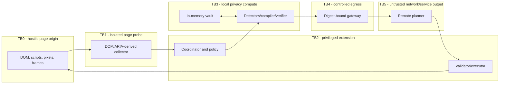

# DrishtiGuard Threat Model

**Version:** 1.0  
**Date:** 4 September 2026  
**Method:** STRIDE-informed abuse-case analysis with privacy and agent-safety extensions  
**Scope:** Browser extension, local privacy runtime, remote planning service, release pipeline and synthetic demo portal

## 1. Security objectives

DrishtiGuard must preserve confidentiality of page-derived data, integrity of local policy and actions, authenticity of extension/service messages, availability without privacy downgrade, and auditable behavior without content leakage.

The most important boundary claim is structural: the outbound gateway cannot accept original capture handles or the token vault. Detection of unknown sensitive meaning remains probabilistic and is represented as residual risk, not hidden behind an absolute guarantee.

## 2. Protected assets

| Asset | Confidentiality | Integrity / availability concern |
|---|---|---|
| Raw screenshot and DOM/task text | Critical | A stale or modified snapshot can misground masks/actions |
| Credentials, OTPs, session tokens, IDs and financial/medical facts | Critical | Must never be intentionally collected for remote use |
| Token vault and token capabilities | Critical | Theft enables re-identification or unauthorized local fill |
| Browser permissions and task capability | High | Abuse can capture or modify an unintended tab/origin |
| Snapshot/navigation/mutation state | High | Tampering creates privacy gaps and TOCTOU actions |
| Privacy policy and detector configuration | High | Weakening can create silent egress |
| Sanitized artifact and verification digest | High | Substitution after verification bypasses the firewall |
| Action plan, target binding and confirmation | High | Manipulation can cause consequential unintended effects |
| Extension/model/service binaries | High | Compromise subverts every higher-level control |
| Logs, crash dumps and telemetry | High | Secondary exfiltration channel |
| Availability and rollback controls | Medium | Outage must not trigger a weaker privacy mode |

## 3. Trust boundaries

See [trust-boundaries.mmd](diagrams/trust-boundaries.mmd).

- **TB0:** The webpage, including same-origin scripts, DOM/ARIA metadata, frames, text, images, canvas, QR codes and timing behavior, is hostile input.
- **TB1:** The isolated content script has temporary read/action access but no screenshot, vault or network capability.
- **TB2:** The extension core owns task authority, permissions, policy and action execution. It trusts only schema-valid messages tied to a current nonce.
- **TB3:** The local compute host handles raw pixels/text, model runtimes, masking, verification and the memory-only vault. Loss cancels the task.
- **TB4:** The gateway accepts only the exact digest approved by the verifier and only an allowed destination.
- **TB5:** TLS protects transport, but the remote service and model output are not trusted to make local policy decisions.
- **TB6 (supply chain/operations):** Extension store, CI, package registries, model host, signing keys, server image registry, proxies, APM and administrators are part of the operational attack surface.

## 4. Threat actors

- A malicious webpage author using prompt injection, deceptive controls, DOM clobbering, mutation races, invisible text, canvas, frames or data URLs.
- A compromised third-party page or advertisement in an otherwise trusted origin.
- A network attacker attempting interception, replay, downgrade or endpoint substitution.
- A compromised or malicious remote VLM/service returning unsafe or malformed plans.
- A curious service operator or telemetry administrator seeking content.
- A malicious or compromised extension dependency, model file, build runner, update channel or developer account.
- Another extension or local process attempting to read browser memory/storage or spoof messages.
- An authorized user making an error, confirming the wrong effect or enabling an overly broad origin.
- A denial-of-service actor triggering capture storms, adversarial images, expensive OCR or GPU queue exhaustion.

Local administrator compromise, kernel/browser compromise, physical memory forensics and malicious enterprise root certificates are outside the initial guarantee. They remain explicit residual risks.

## 5. Attack surfaces

- Extension action, side panel, content scripts, runtime messaging and browser APIs.
- Visible-tab capture, image decode/encode, OCR/model inputs and cross-frame coordinate transforms.
- DOM/ARIA attributes, form values, shadow roots, URLs and mutation events.
- Token creation/resolution and task/navigation lifecycle.
- Gateway serialization, multipart construction, endpoint configuration and authentication.
- Remote HTTP ingress, proxy/APM, prompt template, VLM runtime and output parser.
- Local execution, form events, navigation and confirmation UI.
- Browser storage, console, crash capture, traces and metrics.
- NPM/Python/container dependencies, WASM, ONNX weights, model download/cache and signing pipeline.

## 6. STRIDE and privacy analysis

| ID | Category | Threat / abuse case | Primary controls | Detection / test | Residual risk |
|---|---|---|---|---|---|
| T01 | Spoofing | Page script sends a message pretending to be the trusted probe | Isolated world, `runtime.id`/sender checks, task nonce, role, sequence, schema | Forged/replayed message tests | Browser/extension compromise defeats boundary |
| T02 | Spoofing | Attacker substitutes the remote endpoint or service identity | Fixed allowlist, TLS validation, signed config, short-lived audience-bound token | DNS/proxy fault tests, certificate errors | Malicious enterprise trust root |
| T03 | Tampering | Page mutates between DOM collection, screenshot, mask and click | Read-capture-read state check, mutation epoch, cancellation, pre/post-confirm validation | Mutation/scroll/zoom/navigation race suite | Mutation not observable before a synchronous effect |
| T04 | Tampering | Encoded payload changes after verification | Immutable buffer ownership, SHA-256 envelope, gateway recomputation | Flip-byte and multipart-order tests | Compromised gateway code |
| T05 | Tampering | Model/policy file is replaced | Signed manifest, pinned hash, quarantine, rollback | Corrupt/cache-substitution tests | Signing-key compromise |
| T06 | Repudiation | Consequential action has no trustworthy consent record | Extension-owned confirmation bound to action digest; safe receipt | Confirmation expiry/replay tests | User can still misunderstand sanitized description |
| T07 | Information disclosure | Raw screenshot or DOM is sent accidentally | Non-serializable raw handles, gateway-only networking, lint/CSP, final-byte DLP | Intercept actual client/server bytes with canaries | Fully compromised extension |
| T08 | Information disclosure | Screenshot is masked but task/ARIA/URL/action argument leaks value | Cross-modal privacy compiler, forbidden-field schema, task sanitizer | Same canary in every modality | Unknown semantic inference from safe-looking context |
| T09 | Information disclosure | Blur/pixelation or alpha/metadata reveals content | Solid masks, fresh flattened image, fixed encoder, metadata/alpha check, adversarial OCR | Resize/contrast/crop/OCR and metadata suite | Unseen side channels in codec/runtime |
| T10 | Information disclosure | PII detector misses a value, face or confidential fact | Ensemble, coverage map, union masking, unknown-region block, enterprise rules | Per-class/surface recall, adversarial cases | Inherent probabilistic false negatives |
| T11 | Information disclosure | Token strings are guessed or page injects `[PAN_1]` | Random opaque token capability, task/origin/field/purpose binding; display label never resolves | Guess, collision, cross-task and literal-placeholder tests | Local memory theft |
| T12 | Information disclosure | Vault survives task/navigation or leaks through storage | Memory-only compute host, TTL, explicit invalidation, no serializer | Tab close/reload/update/navigation storage scan | JS strings cannot be guaranteed physically zeroized |
| T13 | Information disclosure | Proxies, APM or exception logs retain sanitized/raw body | Request-body logging disabled at every hop, content-free errors, deployment audit | Seeded log/crash scan | Operator changes configuration after audit |
| T14 | Denial of service | Page creates capture/mutation storm | Debounce, two/s cap, one job per tab, cancellation, work budget | Mutation-flood tests | User-visible loss of automation, safely |
| T15 | Denial of service | Crafted image/model input causes OOM or long inference | Pixel/ROI limits, decoder bounds, timeouts, tiered certified runtime | Oversize/decompression/adversarial image tests | Device-specific driver failure |
| T16 | Elevation of privilege | Prompt injection requests secret access, upload or policy change | Observation channel, closed action union, local effect policy, no model tools | AgentDojo-derived and visual injection suite | Novel attacks may reduce task utility |
| T17 | Elevation of privilege | Remote returns JavaScript, selectors, coordinates or arbitrary URL | `additionalProperties:false`, discriminated action schema, server and client validation | Fuzz/unknown-action tests | Parser/library vulnerability |
| T18 | Elevation of privilege | Benign-looking click submits/deletes/pays | Effect-based risk, form/ancestor context, confirmation, revalidation | Deceptive-label and hidden-form tests | Semantic ambiguity leads to block/manual mode |
| T19 | Elevation of privilege | Cross-origin iframe/canvas target is clicked incorrectly | MVP DOM-backed execution only; inaccessible targets user-assisted | Opaque-surface action tests | Reduced coverage and utility |
| T20 | Repudiation / replay | Old action plan is reused on a new page | Request nonce, snapshot/navigation/mutation binding, expiry, one-time action ID | Replay and delayed-response tests | Clock anomalies; use monotonic expiry locally |
| T21 | Tampering | Dependency/model update weakens privacy | Lockfile, SBOM, signed hashes, benchmark gates, two-person review, canary rollout | Reproducible build and regression suite | Upstream backdoor not detected by tests |
| T22 | Information disclosure | Telemetry or debugging exports raw content | Fixed content-free schema, local-only debug, explicit opt-in, drop on scrub failure | Storage/console/collector canary scan | Manual developer tools can expose local data |
| T23 | Spoofing | Confirmation UI is imitated by the webpage | Browser extension-owned side panel/popup; no page overlay confirmation | UI-origin/phishing test | User may not distinguish extensions in general |
| T24 | Tampering | Coordinate confusion leaves pixels unmasked or clicks neighbor | Actual-dimension scale, bounds and transform tolerance, region padding | DPR/zoom/scroll/frame/transform matrix suite | Browser rendering edge cases |
| T25 | Information disclosure | Sanitized context still enables re-identification by combination | Data minimization, scene-graph-first, derived facts, policy thresholds | k-anonymity-style uniqueness heuristics and review | Contextual inference cannot be eliminated universally |

## 7. Prompt injection and malicious webpages

Webpage text is data, never instruction authority. The prompt constructor places it in a delimited `UNTRUSTED_OBSERVATION` channel. It cannot change allowed origins, token resolution, privacy rules, action policy or confirmation requirements.

The remote model has no direct browser tool. A returned plan must survive:

1. strict schema and size validation;
2. task/request/snapshot nonce validation;
3. local task and origin scope;
4. live target binding;
5. deterministic effect policy;
6. user confirmation when required; and
7. a second state/target validation.

Tests place hostile instructions in visible text, tiny text, hidden DOM, accessibility names, image pixels, canvas, PDF-like images, QR codes and cross-origin frames. Required negative outcomes include attempts to upload a file, read a password/OTP, change permissions, navigate to an arbitrary origin and submit outside the stated task.

AgentDojo is used to inspire policy and indirect-injection scenarios, not as a visual-grounding benchmark [R14].

## 8. Extension compromise

If trusted extension code is fully compromised, the gateway abstraction alone cannot protect data because the attacker executes inside the trusted computing base. Defense is preventive and detective:

- least privilege and explicit activation;
- no remote executable code;
- restrictive CSP and isolated worlds;
- exact locks, SCA/SBOM, signed builds and store distribution;
- model/runtime hash verification;
- two-person review of capture, privacy and networking code;
- static rules that forbid network APIs outside adapters;
- reproducible artifact comparison and staged rollout;
- emergency kill switch that disables remote egress;
- continuous canary-based privacy regression.

The kill switch must only reduce capability. It cannot activate a less private pipeline.

## 9. Server and network compromise

TLS, authentication and rate limiting address interception and abuse, but the remote service is assumed potentially curious or compromised. It receives no raw token map and cannot directly act. Local validation and confirmation remain effective if the model is malicious.

The service must not include URL-fetch, browser, filesystem or shell tools. It rejects oversized images, malformed multipart bodies, unknown schema versions and replayed request IDs. Its reverse proxy, framework, model server and APM disable body logging. Secrets reside in server secret management, not extension bundles or images.

Server compromise can still expose the sanitized request and infer sensitive context. That is why the preferred request is scene-graph-only and the privacy model treats sanitized context as confidential derived data even when it is permitted for transient processing.

## 10. Screenshot and token-map leakage

Raw image bytes use linear ownership: capture adapter -> local worker -> privacy compiler -> zeroization/dereference. They are never written to IndexedDB, local storage, extension storage, cache, clipboard, console or error reports. Transferable buffers avoid copies where possible.

The token vault uses random 128-bit or stronger IDs, independent per task. Entries contain type, value buffer/handle, task, purpose, origin/field constraint, navigation scope, expiry and remaining uses. Display counters are not capabilities. Token resolution occurs only inside the executor after an allowed `token_ref` action and immediately before setting an approved field.

JavaScript garbage collection and immutable strings prevent a claim of guaranteed physical zeroization. The design minimizes lifetime/copies and overwrites mutable buffers, but local memory forensics remains out of scope.

## 11. Supply-chain controls

| Layer | Required control |
|---|---|
| NPM/Python | Exact lock, registry integrity, dependency review, SCA, SBOM, license gate |
| Extension build | Hermetic/reproducible build where practical, protected signing, store signature |
| WASM/runtime | Packaged version, CSP-compatible build, hash and provenance |
| ONNX/OCR/VLM weights | Signed model manifest, SHA-256, license record, benchmark attestation |
| Container | Minimal base image, digest pin, scan, non-root, read-only filesystem where possible |
| CI/CD | Protected branch, two-person approval, short-lived credentials, artifact provenance |
| Configuration | Signed allowlist and policy, monotonic version, safe rollback |
| Operations | Least-privilege IAM, content logging disabled, audit of config drift |

## 12. Residual risk register

| Risk | Why it remains | Treatment |
|---|---|---|
| Unknown PII/confidential data is missed | Recognition is probabilistic and domain-dependent | Measure per class/surface; conservative coverage and site policy; sponsor accepts residual risk |
| Sanitized context enables inference | Combinations may uniquely identify a person or organization | Minimize fields, send derived facts, scene-graph first, no retention |
| Local device/browser compromise | Attacker is inside the trusted boundary | State as out of scope; enterprise hardening for pilot |
| Confirmation misunderstanding | Sanitization can obscure context | Clear effect summary, origin alias, manual mode for ambiguity |
| Cross-origin/canvas/PDF utility gap | Standard extension APIs cannot bind all visual targets | Mask/read/manual-assist or reviewed site adapter |
| Model adversarial examples | Detectors and VLMs can be manipulated | Diverse tests, union masking, coverage gate, local policy |
| Operational log drift | Proxy/APM settings can change | Config-as-code, drift audit, canary monitoring |
| Browser/runtime variance | API and GPU behavior differs | Frozen compatibility matrix and certified fallback |

Residual risks must be accepted explicitly before pilot. Weighted SIH performance cannot waive a critical privacy or action-safety gate.

## 13. Security verification plan

- Contract fuzzing for every local/wire schema and unknown field.
- Static import graph proving only gateway/artifact/telemetry adapters have network APIs.
- Seeded canaries in pixels, task, DOM, ARIA, URLs, attributes, OCR and action arguments; scan actual client request, server ingress and all logs.
- Adversarial OCR after scale, sharpen, contrast, crop, format conversion and channel inspection.
- Message spoof/replay, permission expiry, service-worker eviction and vault-loss tests.
- Navigation, mutation, resize, zoom, frame and confirmation-delay races.
- Prompt-injection and deceptive-target scenarios adapted from AgentDojo.
- Dependency/model substitution, corrupt cache and rollback exercises.
- Fault injection for GPU/WASM/OCR/service/network failures, asserting no policy downgrade.
- Independent extension and privacy review before any pilot with real data.

## 14. Security acceptance criteria

- Zero raw seeded canaries in intercepted network requests, server logs, browser storage, console, crash output and telemetry for the declared suite.
- Zero execution of stale, replayed, schema-invalid or policy-forbidden plans.
- 100% confirmation enforcement for the declared high-risk action set.
- All critical PII classes meet their frozen per-class recall floor; no micro-average can hide a weak class.
- Every production artifact has verified provenance, dependency/model inventory and rollback target.
- Open critical/high findings block release unless the security owner and sponsor formally narrow scope.
